<p align="center"></p>

<p align="center">
한국어 · <a href="./README.en.md">English</a>
</p>

<p align="center">
<a href="#"></a>
<a href="./LICENSE"></a>
<a href="https://github.com/patty-io/patty-kb/actions/workflows/kb-image.yml"></a>
<a href="https://patty.io"></a>
</p>

<h3 align="center">묻는 순간, 지식이 이어진다</h3>

<p align="center">
Patty KB는 Patty의 내부 지식베이스입니다. 결정·설계·러닝·운영 절차가 전부 여기에 기록되고,<br/>
AI 시맨틱 검색이 키워드가 아니라 <b>의미</b>로 답을 찾아줍니다.<br/>
docmost를 포크해 Patty의 SSO·AI 스택·배포 파이프라인에 맞게 개조해 운영합니다.
</p>

---

## 이 저장소가 하는 일

- **웹 앱 (`apps/client`)** — 페이지 작성·트리 탐색·검색·AI 번역 UI (Next.js)
- **서버 (`apps/server`)** — API, 스페이스/권한, 임베딩 파이프라인, SSO (NestJS)
- **AI 스택** — 임베딩은 **자체 호스팅**(ollama + `bge-m3`, CPU), 답변 생성만 MiniMax API. 벡터 저장은 Postgres **pgvector**
- **SSO** — `login.patty.io`(Keycloak) OIDC 로그인
- **에이전트 인터페이스** — MCP 서버(별도 저장소 `patty-kb-mcp`)로 에이전트가 KB를 직접 읽고 씁니다
- **배포** — GARM → Harbor → Kargo 파이프라인. **서버에 손으로 배포하지 않습니다** (`deploy/README.md`)

## 설계 철학

1. **지식은 회사의 기억이다.** — 결정, 구조, 삽질의 기록까지 여기 남긴다. 기억은 개인이 아니라 저장소에 속한다.
2. **검색은 AI가 한다.** — 키워드 매칭이 아니라 의미(임베딩)로 찾는다. 문서를 몰라도 답에 도달한다.
3. **AI는 가능한 한 로컬에서 돈다.** — 문서 임베딩은 박스의 ollama에서 계산되어 외부로 나가지 않는다. 생성만 MiniMax.
4. **Git이 진실이다.** — 배포는 Kargo 프로모션(=git 커밋)으로만 일어난다. 박스는 그 커밋에 수렴할 뿐이다.
5. **한국어 우선.** — 한국어 문서가 기본, English mirror(`README.en.md`)를 병행한다.

## 구조

```text
브라우저 / MCP 에이전트
      │
      ▼
apps/client (Next.js) ── apps/server (NestJS)
      │                        │
      │                        ├── Postgres 18 + pgvector   문서 본문·벡터
      │                        ├── Redis                     캐시·세션
      │                        ├── ollama (bge-m3)           임베딩 — 로컬, CPU
      │                        └── MiniMax API               답변 생성 — 외부

배포:  git push → GARM 빌드 → Harbor → Kargo 프로모션 → 박스 수렴(2분 타이머)
```

## 빠른 시작 (로컬 개발)

전제: Node 22+ · pnpm 11.25+ (`packageManager` 기준) · Docker

```bash
pnpm install
cp .env.example .env        # APP_SECRET 등 채우기 — openssl rand -hex 32
docker compose -f docker-compose.local-test.yml up -d   # db(pgvector) · redis · ollama
pnpm dev                    # 서버 + 클라이언트 동시 실행
```

## 자주 쓰는 명령

| 명령 | 용도 |
| --- | --- |
| `pnpm dev` | 서버 + 클라이언트 동시 개발 모드 |
| `pnpm server:dev` · `pnpm client:dev` | 개별 실행 |
| `pnpm build` | 프로덕션 빌드 |
| `docker compose -f docker-compose.local-test.yml up -d` · `down` | 로컬 인프라(db/redis/ollama) |

## 저장소 구조

```text
apps/
  client/                  Next.js 웹 앱
  server/                  NestJS API (+ database/migrations)
deploy/                    GitOps 배포 트리 — 배포 규칙의 원본
  production/              프로덕션 compose(박스가 수렴하는 파일) + 수렴 에이전트
  kargo/                   Kargo Project·Warehouse·Stage 정의
docs/
  assets/branding/         히어로·브랜딩 자산
  deployment/              박스 운영 상세 (AI 스택, .env 키 목록)
migration/                 업스트림 docmost 마이그레이션 스크립트
docker-compose*.yml        dev / local-test / (구) prod 구성
Dockerfile                 프로덕션 이미지 (target: installer)
```

## 작업 순서 (기여자·에이전트 공통)

1. **배포 규칙을 먼저 읽는다.** — `deploy/README.md`. 박스에서 빌드하거나 손으로 배포하지 않는다.
2. **비밀값은 박스에만 둔다.** — `.env`는 서버(`/opt/docmost/.env`)에만 존재한다. 저장소에 절대 커밋하지 않는다.
3. **배포는 프로모션으로만.** — 커밋 → 이미지 빌드 → Kargo에서 Promote. 박스는 2분 안에 스스로 수렴한다.
4. **플랫폼 문서를 참조한다.** — KB → *Engineering Culture → CI/CD & Deployment* (파이프라인 구조·런북·고장 대응 전부 여기 있다).
5. **새로운 것을 알게 되면 KB에 먼저 쓴다.** — 이 저장소가 회사의 기억이다. 다음 사람은 당신의 기록을 읽는다.

## 문제 해결

- **프로모션했는데 KB가 그대로** — 박스 수렴은 최대 2분 지연. `journalctl -t kb-deploy`로 수렴 로그 확인.
- **검색이 안 된다** — `docker ps | grep ollama`로 임베딩 컨테이너 확인 (bge-m3 첫 로드 ~11초, 상주 설정됨).
- **로그인이 안 된다** — `.env`의 OIDC 관련 키(`OPENAI_*`, Keycloak 설정) 확인. 값은 박스에만 있다.
- **기타** — `deploy/README.md`의 Hard rules와 KB의 Pipeline Runbook을 먼저 확인.

## 참고 문서

- [`deploy/README.md`](./deploy/README.md) — 배포·프로모션·롤백 런북 (배포 규칙의 원본)
- [`docs/deployment/patty-kb.md`](./docs/deployment/patty-kb.md) — 박스 운영 상세 (AI 스택, `.env` 키 목록)
- KB → *Engineering Culture → CI/CD & Deployment* — 플랫폼 전체 (GARM·Harbor·Kargo·Argo CD·런북)
- `patty-kb-mcp` — 에이전트가 KB를 읽고 쓰는 MCP 서버

## 라이선스

업스트림 **docmost의 AGPL-3.0** 라이선스를 유지합니다 ([`LICENSE`](./LICENSE)).<br/>
이 저장소는 **Patty Co., Ltd. 내부 운영용 포크**입니다. Patty의 수정·변경분과 내부 배포 구성에 대한 모든 권리는 Patty Co., Ltd.에 있으며, 외부 재배포·재사용을 금지합니다.

<p align="center"><sub>PATTY KB · 지식의 단일 원천 · AI 시맨틱 검색 · GitOps 배포</sub></p>
